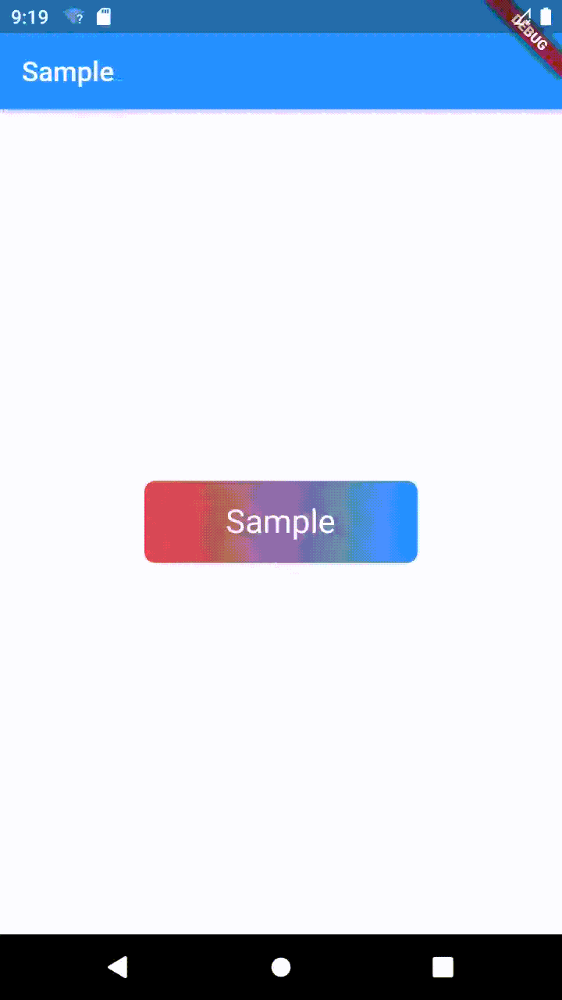

# Loading Button

A simple button that gives you the possibility to
transform into a circular one and shows a progress indicator and with success and error state.



## How to use

```dart
Container(
  width: 200,
  height: 60,
  child: LoadingButton(
    borderRadius: BorderRadius.all(Radius.circular(8)),
    gradient: new LinearGradient(
      colors: <Color>[
        Colors.red,
        Colors.blue,
      ]
    ),
    strokeWidth: 2,
    child: Text(
      "Sample",
      style: TextStyle(
        color: Colors.white,
        fontSize: 24,
      ),
    ),
    errorChild: const Icon( Icons.close_sharp, color: Colors.white, ),
    successChild: const Icon( Icons.check_sharp, color: Colors.white, ),
    onPressed: ( controller ) async {
      await controller.loading();
      await new Future.delayed( const Duration( seconds: 3 ) );
      if ( Random.secure().nextBool() )
        await controller.success();
      else await controller.error();
    },
  ),
),
```

Please check the example folder for a simple implementation.

## Changelog

Please see the [Changelog](CHANGELOG.md) page to know what's recently changed.

## Contributions

Feel free to contribute to this project.

If you find a bug or want a feature, but don't know how to fix/implement it, please fill an [issue](https://github.com/LeonColt/gradient_loading_button/issues).
If you fixed a bug or implemented a new feature, please send a [pull request](https://github.com/LeonColt/gradient_loading_button/pulls).

## License

This project is licensed under the MIT License - see the [LICENSE.md](LICENSE.md) file for details
